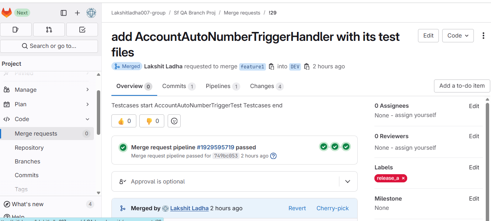

#### SCENERIO 1

From single feature branch(feature1) multiple MRs are raised with different lables

1. From feature1, MR1 is raised, this MR contains 4 files:
   a> AccountAutoNumberTriggerHandler.cls
   b> AccountAutoNumberTriggerHandler.cls-meta.xml
   c> AccountAutoNumberTriggerTest.xml
   d> AccountAutoNumberTriggerTest.cls-meta.xml

This MR is tagged with "release_a"

2. From feature1, MR2 is raised, this MR contains 4 files:
   a> HelloWorld.cls
   b> HelloWorldcls-meta.xml
   c> HelloWorldTest.cls-meta.xml
   d> HelloWorldTest.cls-meta.xml

This MR is tagged with "release_b"

3. From feature1, MR3 is raised, this MR contains 4 files:
   a> GreetingService.cls
   b> GreetingService.cls-meta.xml
   c> GreetingServiceTest.cls
   d> GreetingServiceTest.cls-meta.xml
