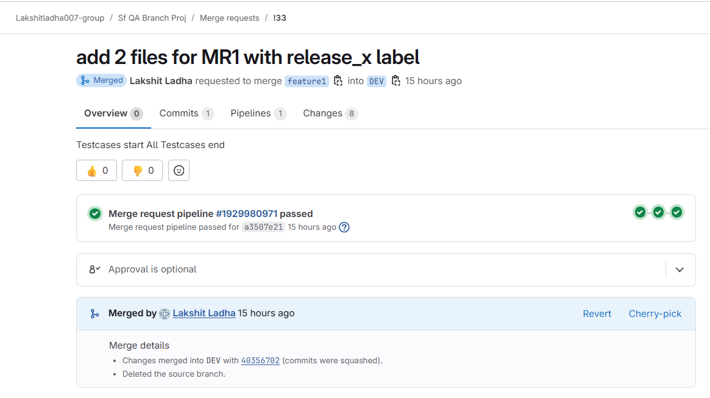
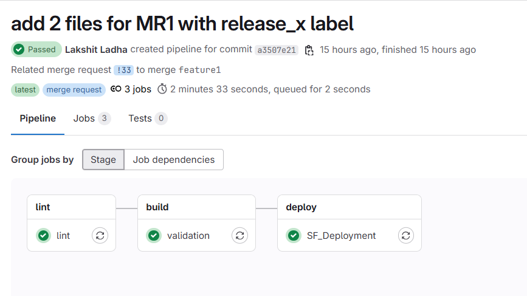
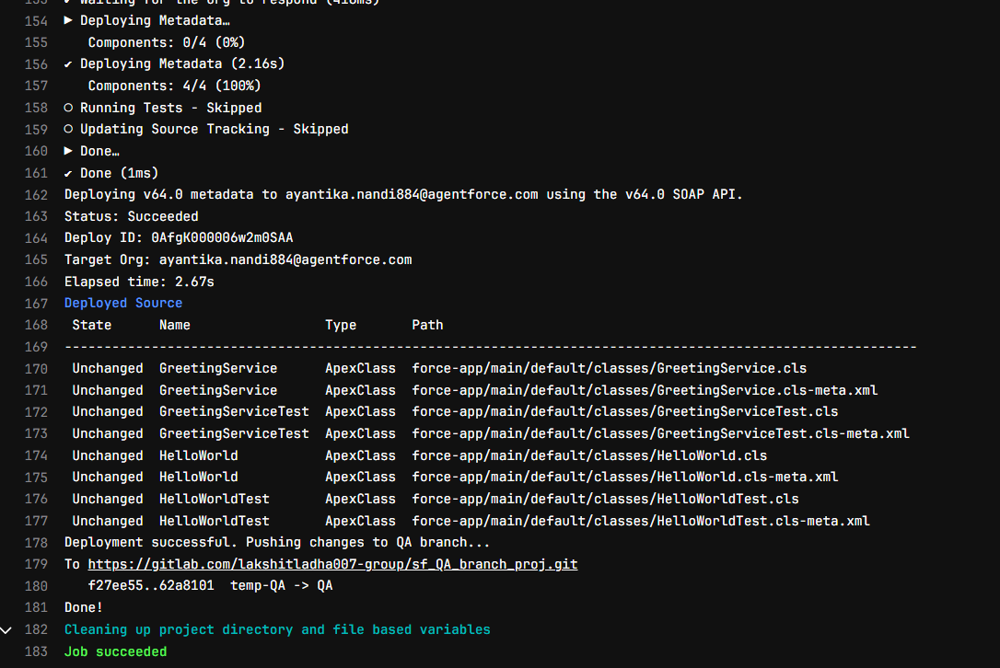
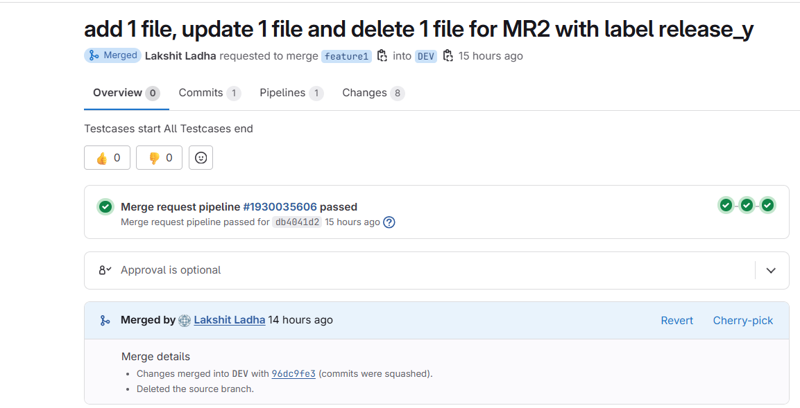
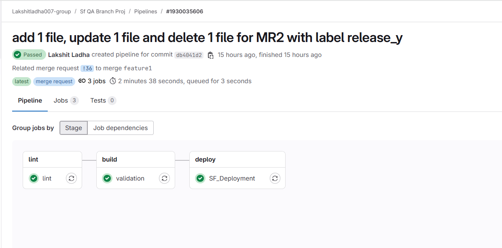
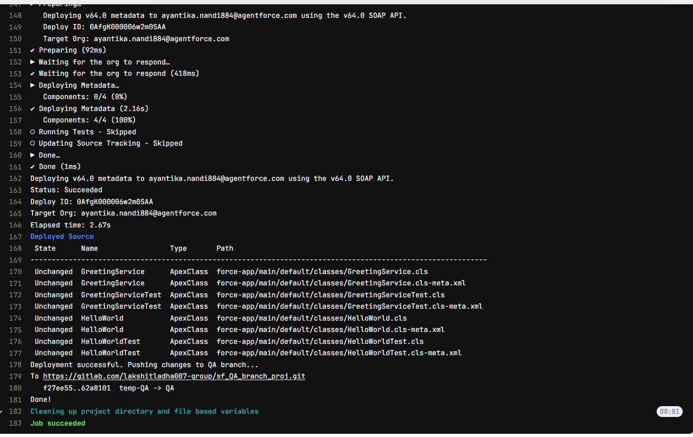

#### Scenerio:

This scenerio focuses on commmon file shared between multiple MRs from a single feature branch.

1. From feature1, MR1 is raised, this MR contains 2 files:
   a> HelloWorld.cls
   b> HelloWorldcls-meta.xml
   c> HelloWorldTest.cls-meta.xml
   d> HelloWorldTest.cls-meta.xml

   a> GreetingService.cls
   b> GreetingService.cls-meta.xml
   c> GreetingServiceTest.cls
   d> GreetingServiceTest.cls-meta.xml

This MR is tagged with label "release_x"

Raise MR from feature1 to DEV:
 

DEV Pipeline Success:(Automatically Triggered)

QA Pipeline Success:(Manually Triggered)

2. From feature1, MR2 is raised, this MR contains 1 new file1, deleted 1 files and updated 1 file:

   ADDED FILES:
   a> AccountAutoNumberHandler.cls
   b> AccountAutoNumberHandler.cls-meta.xml
   c> AccountAutoNumberHandlerTest.cls
   d> AccountAutoNumberHandlerTest.cls-meta.xml

   UPDATED FILES:
   a> HelloWorld.cls
   b> HelloWorldcls-meta.xml
   c> HelloWorldTest.cls-meta.xml
   d> HelloWorldTest.cls-meta.xml

   DELETED FILES:
   a> GreetingService.cls
   b> GreetingService.cls-meta.xml
   c> GreetingServiceTest.cls
   d> GreetingServiceTest.cls-meta.xml

This MR is tagged with "release_y"

Raise MR from feature1 to DEV:
 

DEV Pipeline Success:(Automatically Triggered)

QA Pipeline Success:(Manually Triggered)

3. From feature1, MR3 is raised, this MR contains 1 new file, 1 updated file:
   ADDED FILE:
   a> AccountAutoNumberHandler.cls
   b> AccountAutoNumberHandler.cls-meta.xml
   c> AccountAutoNumberHandlerTest.cls
   d> AccountAutoNumberHandlerTest.cls-meta.xml

   UPDATED FILES:
   a> HelloWorld.cls
   b> HelloWorldcls-meta.xml
   c> HelloWorldTest.cls-meta.xml
   d> HelloWorldTest.cls-meta.xml
 
This MR is tagged with "release_y"