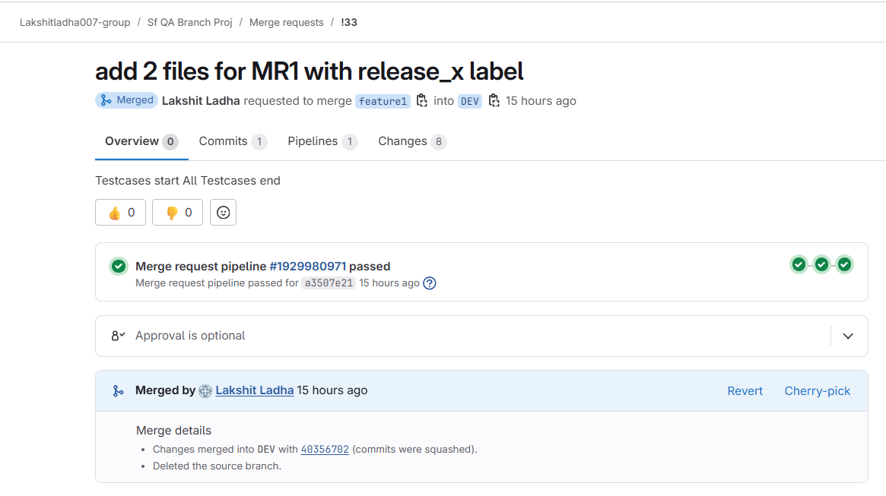
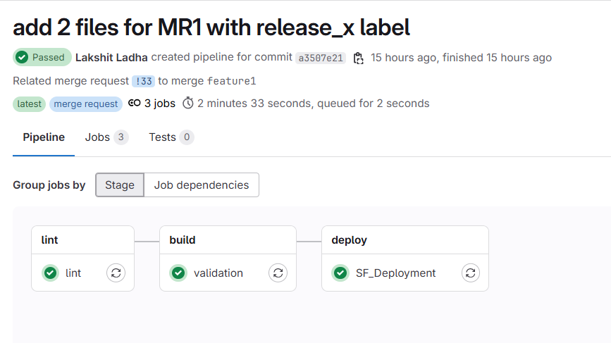
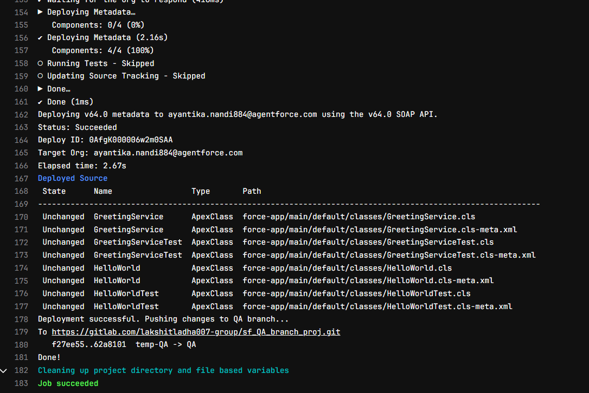
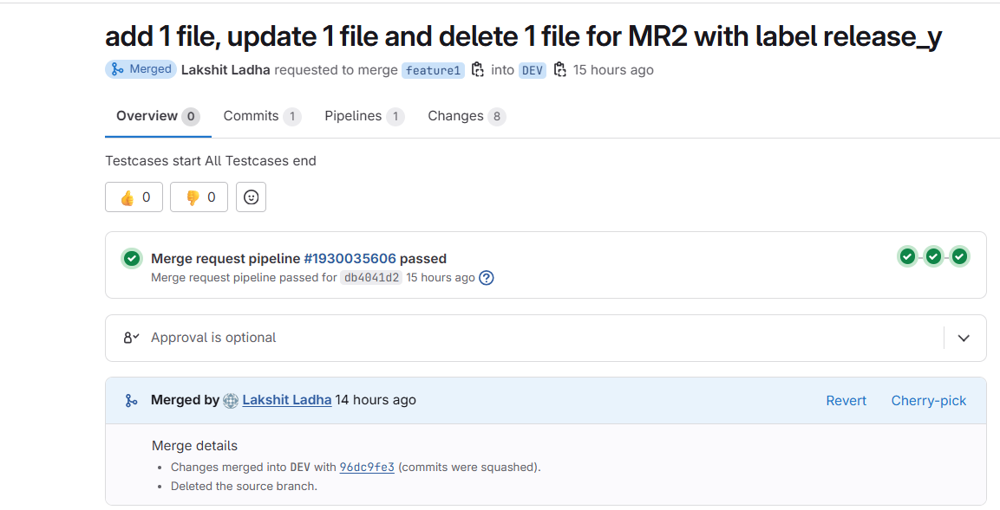
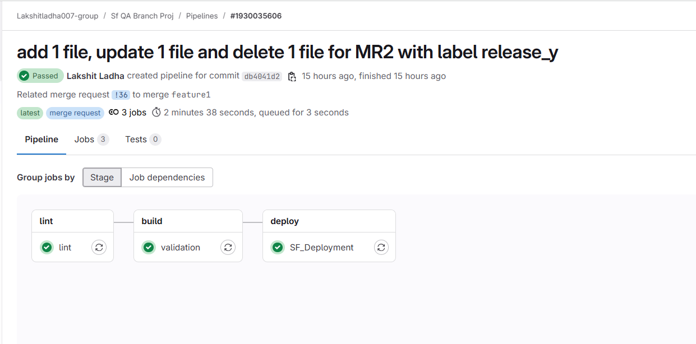
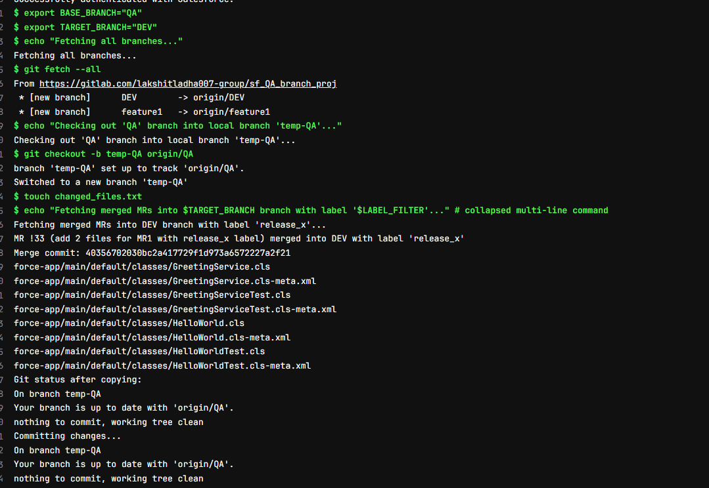
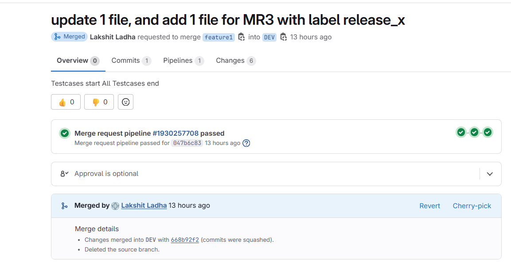
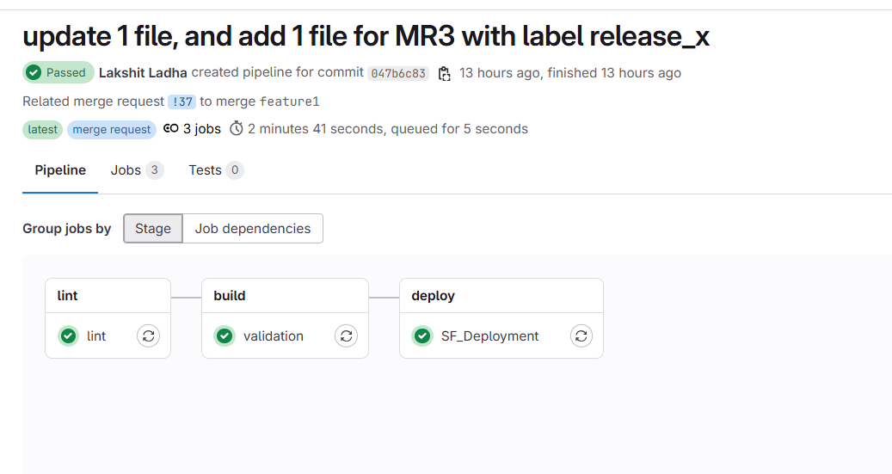
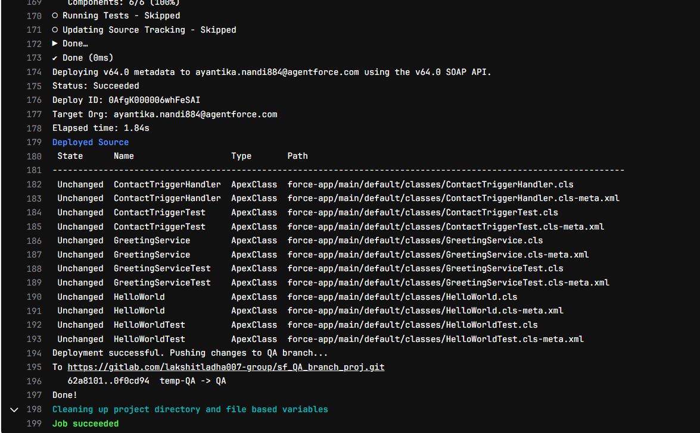

## Test Case 1

This testcase focuses on commmon file shared between multiple MRs from a single feature branch.

1. From feature1, MR1 is raised and  this MR contains 2 files{**release_x**}:    
   a> HelloWorld.cls 
   b> HelloWorldcls-meta.xml 
   c> HelloWorldTest.cls-meta.xml 
   d> HelloWorldTest.cls-meta.xml 

   a> GreetingService.cls 
   b> GreetingService.cls-meta.xml 
   c> GreetingServiceTest.cls 
   d> GreetingServiceTest.cls-meta.xml 

This MR is tagged with label "release_x" 

#### Raise MR from feature1 to DEV: 
 

#### DEV Pipeline Success:(Automatically Triggered)

#### QA Pipeline Success:(Manually Triggered)

2. From feature1, MR2 is raised and this MR contains 1 new file1, deleted 1 files and updated 1 file{**release_y**}: 

   ADDED FILES: 
   a> AccountAutoNumberHandler.cls 
   b> AccountAutoNumberHandler.cls-meta.xml 
   c> AccountAutoNumberHandlerTest.cls 
   d> AccountAutoNumberHandlerTest.cls-meta.xml 

   UPDATED FILES: 
   a> HelloWorld.cls 
   b> HelloWorldcls-meta.xml 
   c> HelloWorldTest.cls-meta.xml 
   d> HelloWorldTest.cls-meta.xml 

   DELETED FILES: 
   a> GreetingService.cls 
   b> GreetingService.cls-meta.xml 
   c> GreetingServiceTest.cls 
   d> GreetingServiceTest.cls-meta.xml 

This MR is tagged with "release_y"

#### Raise MR from feature1 to DEV:
 

#### DEV Pipeline Success:(Automatically Triggered)

#### QA Pipeline Success:(Manually Triggered)

3. From feature1, MR3 is raised, this MR contains 1 new file, 1 updated file{**release_x**}: 
   ADDED FILE: 
   a> ContactTriggerHandler.cls 
   b> ContactTriggerHandler.cls-meta.xml 
   c> ContactTriggerTest. 
   d> ContactTriggerTest.cls-meta.xml 

   UPDATED FILES: 
   a> HelloWorld.cls 
   b> HelloWorldcls-meta.xml 
   c> HelloWorldTest.cls-meta.xml 
   d> HelloWorldTest.cls-meta.xml 
 
This MR is tagged with "release_x"

#### Raise MR from feature1 to DEV:
 

#### DEV Pipeline Success:(Automatically Triggered)

#### QA Pipeline Success:(Manually Triggered)
