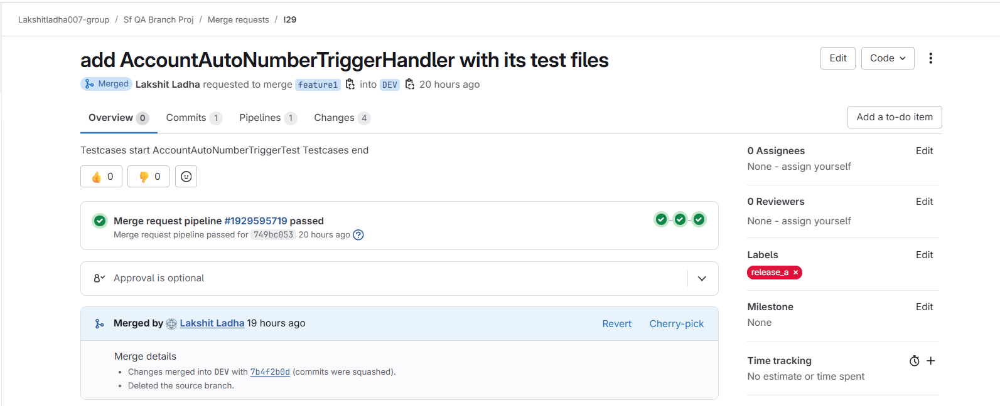
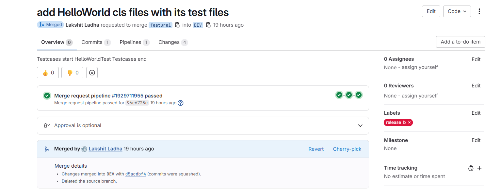
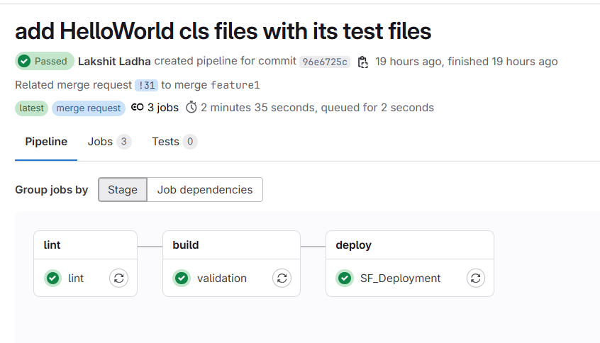
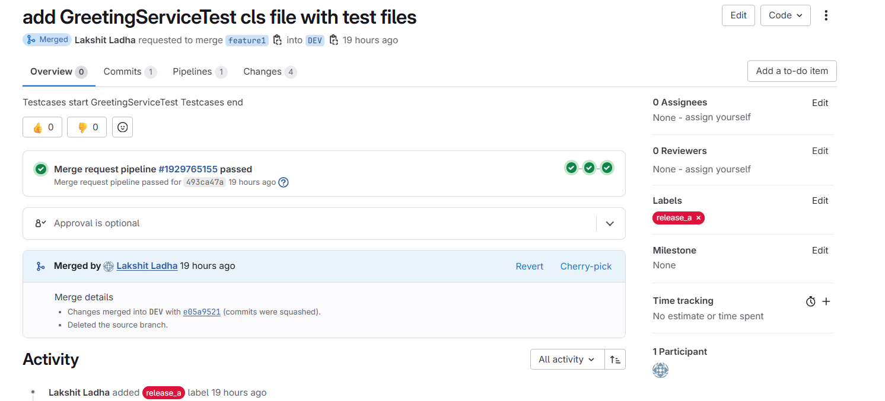
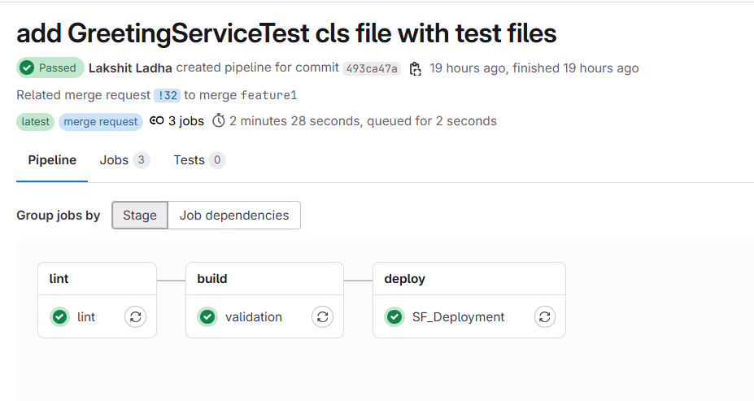
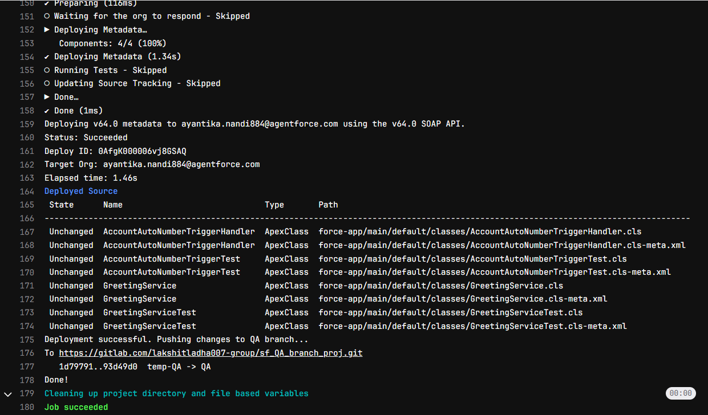

## Test Case 2

From single feature branch(feature1) multiple MRs are raised with different lables.

1. From feature1, MR1 is raised, this MR contains 4 files: 
   a> AccountAutoNumberTriggerHandler.cls 
   b> AccountAutoNumberTriggerHandler.cls-meta.xml 
   c> AccountAutoNumberTriggerTest.xml 
   d> AccountAutoNumberTriggerTest.cls-meta.xml 

This MR is tagged with "release_a"

#### Raise MR from feature1 to DEV: 
 

#### DEV Pipeline Success:(Automatically Triggered)

2. From feature1, MR2 is raised, this MR contains 4 files: 
   a> HelloWorld.cls 
   b> HelloWorldcls-meta.xml 
   c> HelloWorldTest.cls-meta.xml 
   d> HelloWorldTest.cls-meta.xml 

This MR is tagged with "release_b"

#### Raise MR from feature1 to DEV: 
 

#### DEV Pipeline Success:(Automatically Triggered)

3. From feature1, MR3 is raised, this MR contains 4 files: 
   a> GreetingService.cls 
   b> GreetingService.cls-meta.xml 
   c> GreetingServiceTest.cls 
   d> GreetingServiceTest.cls-meta.xml 

This MR is tagged with "release_a"

#### Raise MR from feature1 to DEV: 
 

#### DEV Pipeline Success:(Automatically Triggered)

#### QA Pipeline Success:(Manually Triggered after merging all MRs into DEV)
